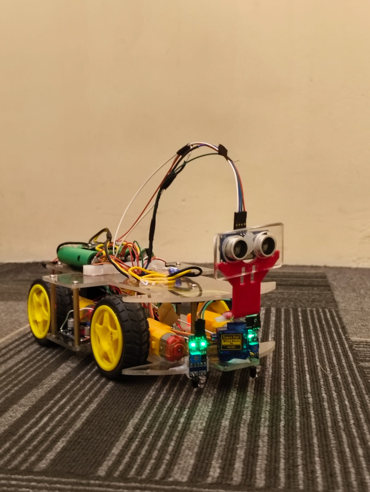
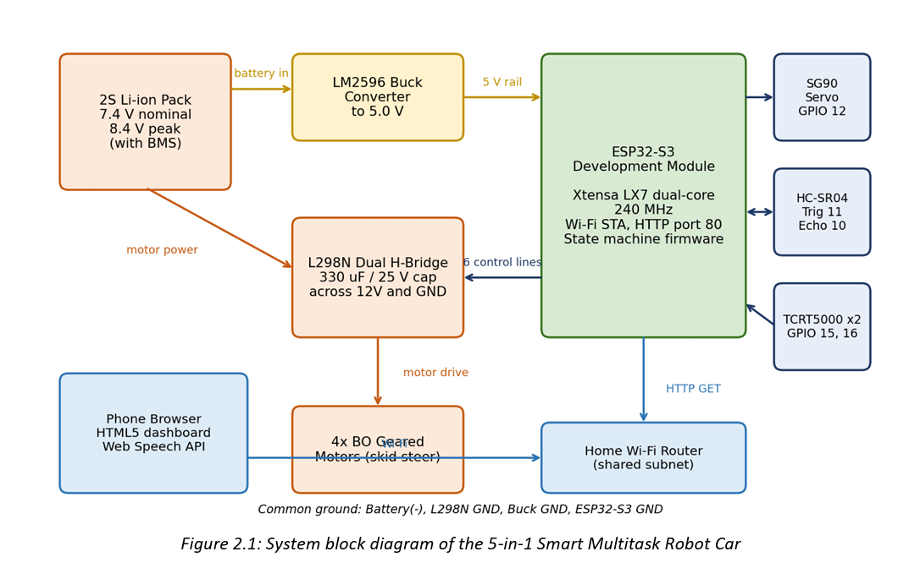
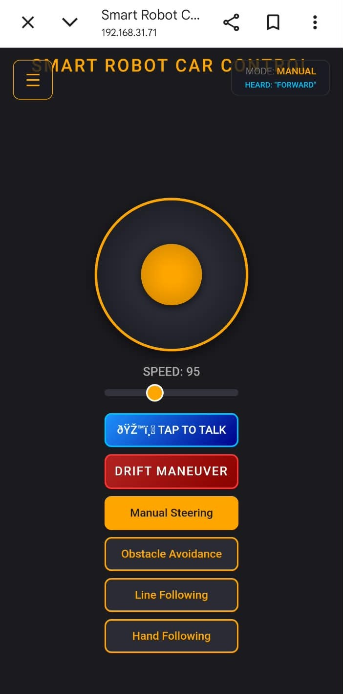

# 5-in-1 Smart Multitask Robot Car 🤖

A four-wheel-drive smart robotic car based on the **ESP32-S3**, integrating multiple driving and automation capabilities into a single-controller embedded system.



## 🚀 Project Overview

The **5-in-1 Smart Multitask Robot Car** is an ESP32-S3 based robotic platform designed with a single-controller architecture.

The robot combines five operating capabilities:

- 🎮 Manual joystick control
- 🎙️ Voice-commanded driving
- 🚧 Autonomous obstacle avoidance
- 🛣️ Infrared line following
- ✋ Ultrasonic hand following

It also includes an automated **360° drift stunt** and a locally hosted web dashboard for controlling and monitoring the robot.

The project documentation covers the hardware architecture, power system, firmware design, human-machine interface, debugging process, and production source code.

## ✨ Key Features

- ESP32-S3 single-controller architecture
- Four-wheel-drive skid-steering
- L298N dual-channel motor driver
- Wi-Fi based web control
- Browser-based voice commands
- Autonomous obstacle detection and avoidance
- Infrared line-following system
- Ultrasonic hand-following mode
- Servo-based ultrasonic scanning
- Adjustable motor speed
- 360° drift stunt
- Safety-focused mode switching
- Non-blocking firmware architecture

## 🧠 Operating Modes

| Mode | Function |
|---|---|
| Manual | Drive the robot using a web-based joystick and controls |
| Voice | Control movement using voice commands through the browser |
| Obstacle Avoidance | Automatically detect and avoid obstacles |
| Line Following | Follow a path using two TCRT5000 IR sensors |
| Hand Following | Follow a detected hand using ultrasonic distance sensing |

## 🛠️ Hardware

- ESP32-S3
- L298N Motor Driver
- 4 × BO Geared Motors
- SG90 Servo Motor
- HC-SR04 Ultrasonic Sensor
- 2 × TCRT5000 IR Sensors
- 7.4 V Battery Pack
- LM2596 Buck Converter
- 330 µF / 25 V Capacitor
- Resistor divider for ultrasonic Echo protection

## 🔌 System Architecture



The ESP32-S3 acts as the central controller for motor control, sensor acquisition, Wi-Fi communication, web-server operation, and operating-mode management.

## 📱 Mobile Control Interface

The robot provides a web-based control dashboard containing joystick controls, speed adjustment, operating-mode selection, drift control, voice control, and telemetry information.



## 💻 Software

The firmware is developed using the **Arduino-ESP32 framework** and includes:

- Wi-Fi networking
- WebServer
- ESP32Servo
- Motor control
- Ultrasonic sensing
- IR line sensing
- Operating-mode management
- Browser-based control
- Voice command processing

## 📂 Repository Structure

```text
5-in-1-smart-multitask-robot-car/
├── README.md
├── code/
│   └── 5-in-1-car.ino
├── docs/
│   └── 5-in-1-car.pdf
└── images/
    ├── Smart-Robot-Car.jpeg
    ├── mobile-control-interface.jpeg
    └── system-block-diagram.png
